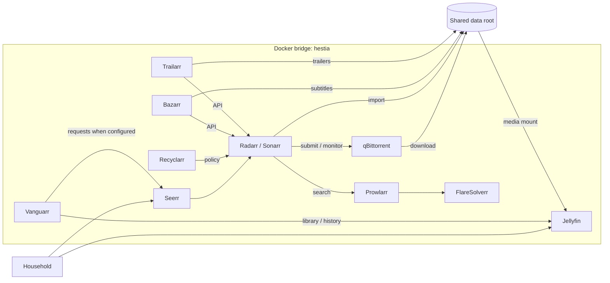

<div align="center">

# Project Hestia
### Self-hosted media automation and delivery

Requests, library automation, quality policy, enrichment and playback in one Docker Compose platform.

[](https://github.com/scott-renny/project-hestia/actions/workflows/validate.yml)


</div>

Hestia is the media-services layer of the COC homelab, hosted on Atlas v1.
This repository publishes its portable infrastructure definition and sanitized
Recyclarr policy. Accounts, API integrations, databases and media remain in the
deployment. Cloning the repository does not reproduce that application state.

## Engineering highlights

- Docker DNS keeps integrations independent of the host address.
- Configuration and bulk media use separate persistent host roots.
- Download and import services share `/data`; Jellyfin sees `/media` and `/transcode`.
- Recyclarr stores selected custom-format policy in Git and resolves API keys outside Git.
- Host paths and numeric identities are configured through an environment file.
- Validation checks repository hygiene, credentials, private addresses and Compose syntax.

## Architecture



The editable diagram source is [architecture.mmd](docs/assets/architecture.mmd).
Arrows describe application integrations and data flow, not Compose startup dependencies.
See [architecture](docs/ARCHITECTURE.md) for network and persistence boundaries.

| Component | Role | Published host port |
| --- | --- | --- |
| Jellyfin | Playback, users and viewing state | 8096 |
| Seerr | Discovery and requests | 5055 |
| Radarr / Sonarr | Movie / television library management | 7878 / 8989 |
| Prowlarr | Indexer integration | 9696 |
| qBittorrent | Download client | 8080; 6881 TCP/UDP |
| FlareSolverr | Supporting indexer integration | None |
| Recyclarr | Custom-format policy synchronization | None |
| Bazarr | Subtitles | 6767 |
| Trailarr | Trailers | 7889 |
| Vanguarr | Recommendation infrastructure | 8000 |

Radarr and Sonarr search through Prowlarr, submit downloads to qBittorrent,
then import completed media. Jellyfin scans the imported library. Subtitle,
trailer and recommendation services integrate through application configuration.

## Deploy and validate

Target: Linux with Docker Engine and Compose v2. The supplied configuration
requires `/dev/dri` for Jellyfin and Trailarr; hardware acceleration also needs
application-side setup. Follow the [deployment guide](docs/DEPLOYMENT.md) before starting.

```bash
git clone https://github.com/scott-renny/project-hestia.git
cd project-hestia
./scripts/validate-repo.sh
```

Validation does not launch containers or access production credentials.
Published ports bind to all host interfaces by default. Restrict access using
deployment-level controls described in [security](docs/SECURITY.md).

## Documentation

| Guide | Contents |
| --- | --- |
| [Architecture](docs/ARCHITECTURE.md) | Service relationships, network and state boundaries |
| [Deployment](docs/DEPLOYMENT.md) | Host preparation, identities, configuration and startup |
| [Storage](docs/STORAGE.md) | Shared paths and migration constraints |
| [Media flow](docs/MEDIA-FLOW.md) | Requests, acquisition, import and enrichment |
| [Operations](docs/OPERATIONS.md) | Troubleshooting, controlled changes and host migration |
| [Security](docs/SECURITY.md) | Exposure, credentials and repository safeguards |
| [Recommendations](docs/RECOMMENDATIONS.md) | Current limitations and evaluation sequence |
| [Roadmap](docs/ROADMAP.md) | Current scope and future work |

## Status and scope

The existing project documentation reports an operational Atlas v1 deployment.
This v1.0 polish pass validates repository configuration, not live service health.
Recommendation quality remains unevaluated pending sufficient genuine viewing history.
Reverse proxy, TLS, remote access and monitoring are outside this Compose stack.
Backup and restore are outside the current project scope.
Most images use mutable `latest` tags; deployments are not fully version-reproducible.

The project demonstrates container orchestration, filesystem and permission design,
API integration, configuration management, operational documentation and CI guardrails.
No benchmark or availability claims are made. No license has been selected.
